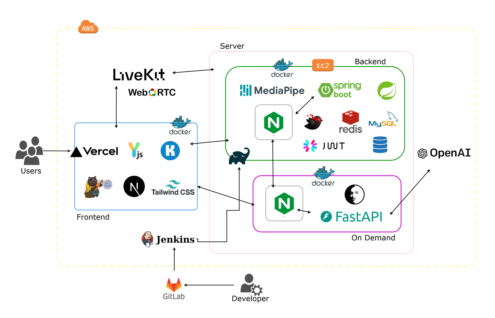
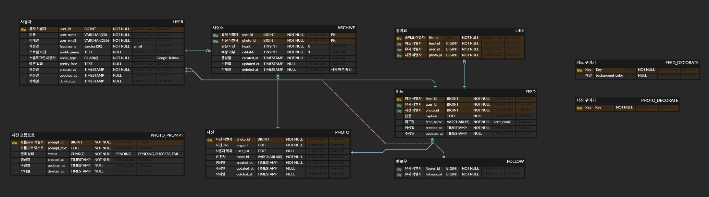
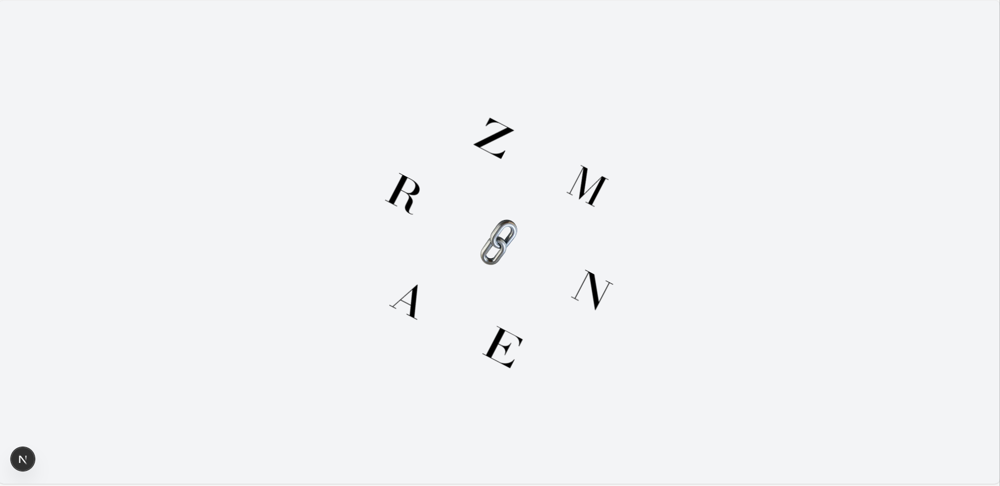
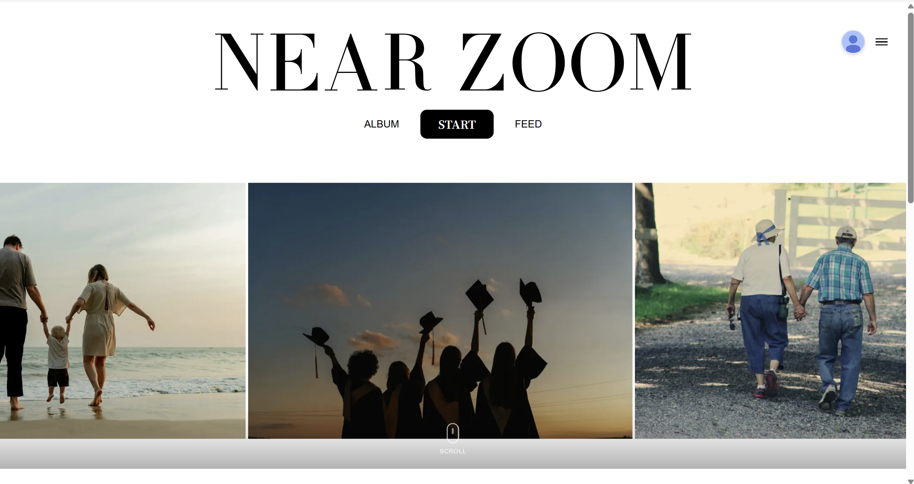
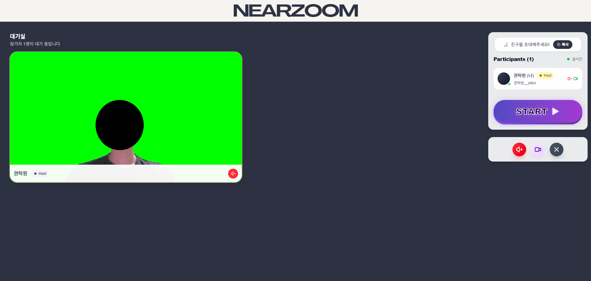
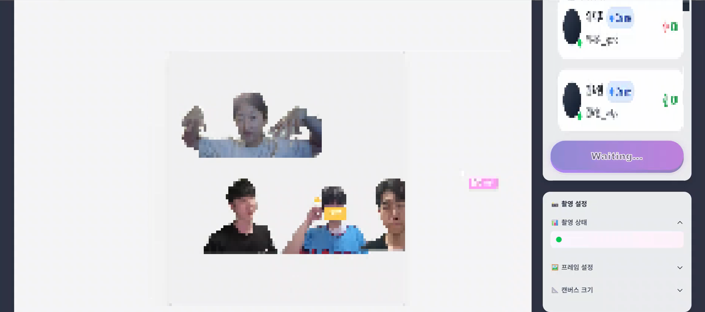
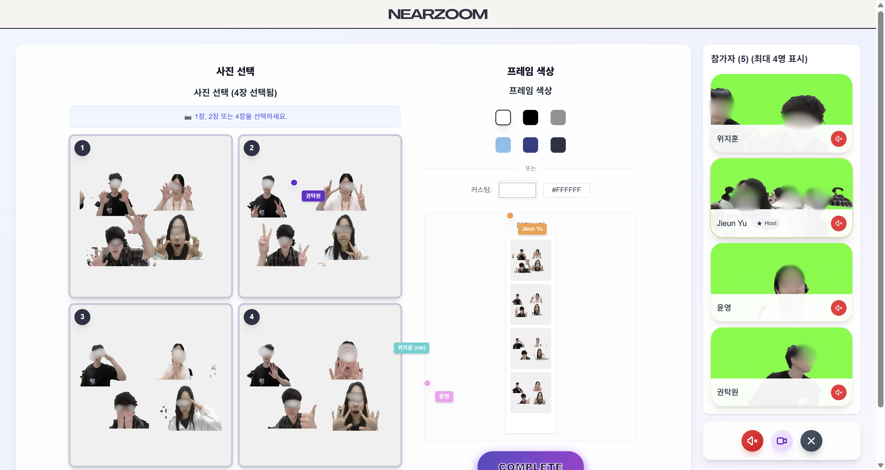
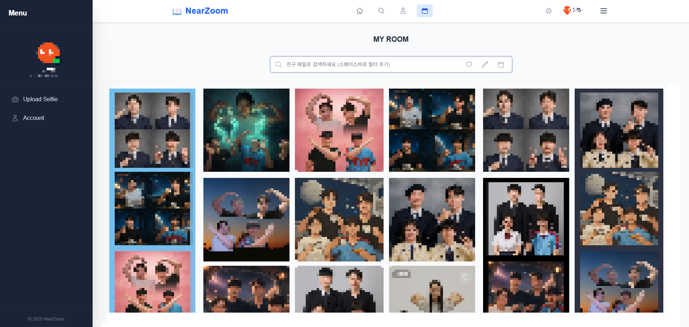
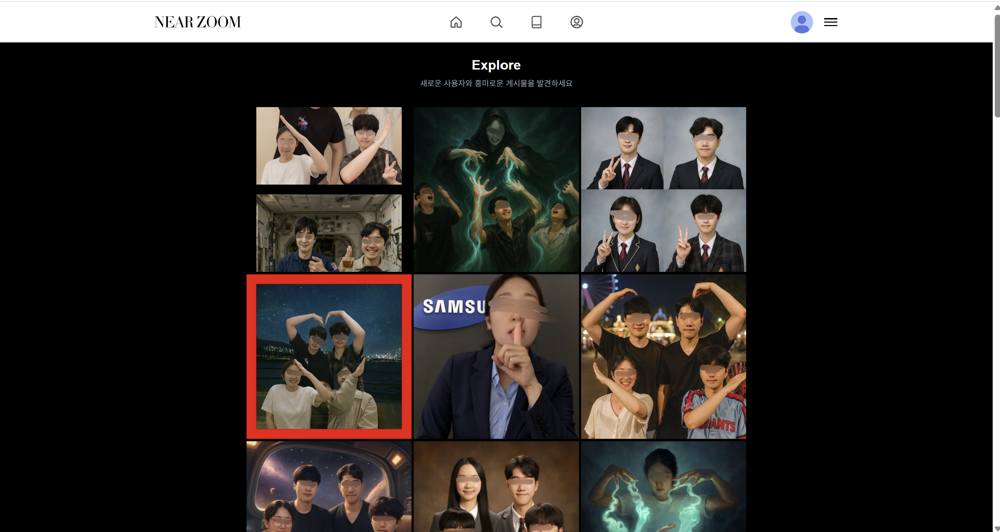
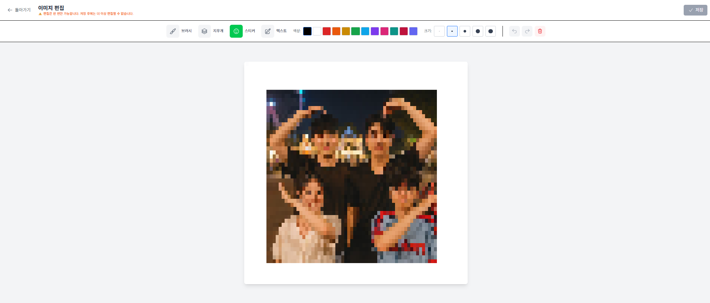

# 이어줌 (NearZoom)

### 삼성 청년 SW아카데미(SSAFY) 13th 공통 프로젝트 

## ✅ 프로젝트 진행 기간

### 2025.07.08 ~ 2025.08.18(6주)

## **✅ 프로젝트 소개**

**🚩 서비스 한줄 소개**

```bash
 따로 또 같이, 실시간 AI 협업으로 만드는 원격 네컷사진 플랫폼
"공간을 넘어 함께하는 네컷사진, 이어줌과 함께 특별한 순간을 만들어보세요"
```

**🚩 기획 배경**

비대면 만남이 일상화되면서, 멀리 떨어진 친구들과도 특별한 추억을 만들고 싶다는 니즈가 증가했습니다. 기존의 화상통화는 단순한 대화에 그쳤고, 오프라인에서만 가능했던 네컷 사진 촬영의 재미를 온라인에서도 경험할 수 있다면 어떨까 하는 아이디어에서 시작되었습니다. 즉, 오프라인의 경험을 온전히 온라인으로 담아내고자 했습니다. 각자 다른 공간에 있어도, ‘함께 찍는 순간’을 만들고 사진을 찍고 끝이 아닌 친구들과 공유하면서 이야기가 만들어지면 좋겠다 생각하여 이어줌 서비스를 만들었습니다.

저희가 해결하고자 한 문제점들:

* 거리적 제약으로 인해 함께 추억을 만들기 어려운 상황
* 기존 화상통화의 단조로운 경험과 기념성 부족
* 개인별 취향을 반영한 커스터마이징의 한계
* 생성된 콘텐츠의 보관 및 공유 방식의 아쉬움

**🚩 프로젝트 설명 및 목표**

이어줌은 실시간 화상통화 기술과 AI 기술을 결합하여 새로운 형태의 소셜 경험을 제공합니다:

* **실시간 그룹 화상통화**: 최대 4명이 동시에 참여하여 함께 네컷 사진을 촬영할 수 있습니다.

* **AI 배경 생성**: 사용자가 원하는 텍스트 프롬프트를 입력하면 AI가 개성 있는 배경을 생성합니다.

* **개인 맞춤형 선택**: 촬영된 4장의 사진 중에서 각자 원하는 컷 수(1장/2장/4장)를 선택할 수 있습니다.

* **다양한 프레임 옵션**: 기본 프레임부터 콜라보 특별 프레임까지 다양한 테마를 제공합니다.

* **커스터마이징 꾸미기 및 공유**: 생성된 네컷 사진과 개별 사진들을 직접 스티커, 드로잉, 텍스트로 꾸미고 피드에 공유할 수 있습니다.

* **개인 보관함**: 생성된 작품을 개인 보관함에 저장하여 언제든 다시 볼 수 있습니다.


**🚩 프로젝트 확장성**

이어줌은 다음과 같은 확장 가능성을 가지고 있습니다:

* 실시간 필터 및 이펙트 기능 추가
* 가상 스튜디오 및 AR 요소 도입
* 생성된 콘텐츠의 NFT화 및 디지털 앨범 서비스

## ✅ 멤버소개

| 역할 | 이름 | 담당 업무 |
|------|------|-----------|
| **팀장/Frontend** | 유지은 | 프로젝트 총괄, 일정관리, 와이어프레임 기획 및 설계<br/>그룹방 기능 React/TypeScript UI/API 연동<br/>메인페이지 UI 개발, 반응형 웹 구현<br/>Zustand 상태관리 |
| **Backend/Frontend** | 박소정 | **Backend:** 이미지 앨범 관리 시스템 (MyBatis 기반 복잡한 필터링, 커서 기반 무한 스크롤)<br/>피드 기능 REST API (JPA 기반 N+1 쿼리 최적화)<br/>**Frontend:** 피드 기능 React/TypeScript UI, Zustand 상태 관리 및 JWT 토큰 자동 갱신<br/>반응형 무한 스크롤 (디바이스별 동적 limit 조정) |
| **Backend/Frontend** | 정윤영 | **Backend:** 이미지 업로드/저장 시스템 구현, JWT 기반 소셜 로그인 연동<br/>**Frontend:** UI 컴포넌트 구현, 소셜 로그인 플로우 연동<br/>Canvas 최적화(Konva.js), 마이페이지 성능 개선, Zustand 상태관리 |
| **Backend/Infra** | 위지훈 | Spring Security(OAuth2+JWT) 기반 소셜 로그인/유저 모듈 개발<br/>Jenkins + Docker Compose로 EC2 자동 배포 파이프라인 구축 |
| **Backend** | 권탁원 | LiveKit 화상통화 연동, 백엔드 API 기능 구현<br/>이미지 서버 연동, Swagger 연동 및 API 문서화 |
| **Backend/Frontend/AI/Infra** | 허민권 | **Backend:** 생성형 이미지 처리 FastAPI 서버, 실시간 글로벌 상태관리 웹소켓 서버 구축<br/>**Frontend:** 포토부스 페이지 개발<br/>**AI:** FaceSwap을 이용한 생성형 이미지 후처리<br/>**Infra:** 이미지 서버 구축, EC2, Nginx 파일 서버 구축 |


## ✅ 기술 스택

### 🛠️ 협업 도구
- **Jira** – 이슈 트래킹 & 프로젝트 관리
- **GitLab** – Git 리포지토리 · CI/CD
- **Figma** – UI/UX 디자인 협업  
- **Canva** - 디자인 협업

### 💻 Frontend
- **Next.js** – React 기반 프레임워크
- **Tailwind CSS** – 유틸리티‑퍼스트 CSS 프레임워크
- **Headless UI** – 접근성(A11y) 보장 UI 컴포넌트
- **Konva.js** – Canvas 그래픽 라이브러리  
- **Zustand** – 전역 상태 관리
- **Yjs** - CRDT 데이터 처리

### 📹 WebRTC  
- **LiveKit** – 실시간 미디어 서버

### 🔧 Backend
- **Spring Boot** – 회원·인증 API (MySQL)
  - MyBatis · JPA
  - Spring Security  
  - Gradle(YAML)
- **Redis** – LiveKit 룸 & 사용자 토큰 캐시
- **Express** - WebSocket 서버
- **FastAPI** – 이미지 후처리 서비스

### 🤖 AI
- **OpenAI Image API** – 생성형 이미지
- **FaceFusion** - 사진 후처리(인물) 파이프라인
- **MediaPipe** – 배경 제거 파이프라인

### ☁️ Cloud / Infra  
- **Docker Compose** - 컨테이너화
- **Amazon EC2** / **On-Demand**
- **Nginx** – 리버스 프록시, 정적파일 서빙
- **Vercel** – 클라이언트 서버

## ✅ 시스템 아키텍처



## ✅ ERD (Entity Relationship Diagram)


### 주요 엔티티 설명
- User, Room, Photo, PhotoSession 등 7개 주요 엔티티
- 각 엔티티의 역할과 주요 속성 설명

## ✅ 프로젝트 구조

### Back-end (Spring Boot)
```
├── main
│   ├── java
│   │   └── com
│   │       └── ssafy
│   │           └── nearzoom
│   │               ├── NearzoomApplication.java
│   │               ├── domain
│   │               │   ├── feed
│   │               │   │   ├── controller
│   │               │   │   │   └── FeedController.java
│   │               │   │   ├── dto
│   │               │   │   │   ├── FeedRequestDto.java
│   │               │   │   │   └── FeedResponseDto.java
│   │               │   │   ├── entity
│   │               │   │   │   └── Feed.java
│   │               │   │   ├── repository
│   │               │   │   │   └── FeedRepository.java
│   │               │   │   └── service
│   │               │   │       └── FeedService.java
│   │               │   ├── myroom
│   │               │   │   ├── controller
│   │               │   │   │   └── MyRoomController.java
│   │               │   │   ├── dto
│   │               │   │   │   ├── MyRoomRequestDto.java
│   │               │   │   │   └── MyRoomResponseDto.java
│   │               │   │   ├── exception
│   │               │   │   │   ├── MyRoomNotFoundException.java
│   │               │   │   │   └── MyRoomAccessDeniedException.java
│   │               │   │   ├── repository
│   │               │   │   │   └── MyRoomRepository.java
│   │               │   │   └── service
│   │               │   │       └── MyRoomService.java
│   │               │   ├── photo
│   │               │   │   ├── entity
│   │               │   │   │   ├── Photo.java
│   │               │   │   │   └── PhotoSession.java
│   │               │   │   ├── repository
│   │               │   │   │   ├── PhotoRepository.java
│   │               │   │   │   └── PhotoSessionRepository.java
│   │               │   │   └── service
│   │               │   │       └── PhotoService.java
│   │               │   ├── photoPrompt
│   │               │   │   ├── config
│   │               │   │   │   └── OpenAIConfig.java
│   │               │   │   ├── controller
│   │               │   │   │   └── PhotoPromptController.java
│   │               │   │   ├── dto
│   │               │   │   │   ├── PromptRequestDto.java
│   │               │   │   │   └── PromptResponseDto.java
│   │               │   │   ├── entity
│   │               │   │   │   └── PhotoPrompt.java
│   │               │   │   ├── repository
│   │               │   │   │   └── PhotoPromptRepository.java
│   │               │   │   └── service
│   │               │   │       └── PhotoPromptService.java
│   │               │   ├── room
│   │               │   │   ├── constants
│   │               │   │   │   ├── RoomStatus.java
│   │               │   │   │   └── RoomType.java
│   │               │   │   ├── controller
│   │               │   │   │   └── RoomController.java
│   │               │   │   ├── dto
│   │               │   │   │   ├── RoomCreateRequestDto.java
│   │               │   │   │   ├── RoomJoinRequestDto.java
│   │               │   │   │   └── RoomResponseDto.java
│   │               │   │   ├── repository
│   │               │   │   │   └── RoomRepository.java
│   │               │   │   └── service
│   │               │   │       └── RoomService.java
│   │               │   └── user
│   │               │       ├── controller
│   │               │       │   └── UserController.java
│   │               │       ├── dto
│   │               │       │   ├── UserRequestDto.java
│   │               │       │   ├── UserResponseDto.java
│   │               │       │   └── LoginRequestDto.java
│   │               │       ├── entity
│   │               │       │   ├── User.java
│   │               │       │   └── UserProfile.java
│   │               │       ├── exception
│   │               │       │   ├── UserNotFoundException.java
│   │               │       │   └── DuplicateUserException.java
│   │               │       ├── repository
│   │               │       │   └── UserRepository.java
│   │               │       └── service
│   │               │           └── UserService.java
│   │               └── global
│   │                   ├── auth
│   │                   │   ├── config
│   │                   │   │   ├── SecurityConfig.java
│   │                   │   │   └── OAuth2Config.java
│   │                   │   ├── jwt
│   │                   │   │   ├── JwtTokenProvider.java
│   │                   │   │   ├── JwtAuthenticationFilter.java
│   │                   │   │   └── JwtTokenValidator.java
│   │                   │   ├── oauth2
│   │                   │   │   ├── OAuth2UserService.java
│   │                   │   │   ├── OAuth2UserInfo.java
│   │                   │   │   └── OAuth2AuthenticationSuccessHandler.java
│   │                   │   └── util
│   │                   │       ├── AuthUtil.java
│   │                   │       └── CookieUtil.java
│   │                   ├── common
│   │                   │   ├── BaseEntity.java
│   │                   │   ├── BaseTimeEntity.java
│   │                   │   └── Constants.java
│   │                   ├── exception
│   │                   │   ├── GlobalExceptionHandler.java
│   │                   │   ├── CustomException.java
│   │                   │   └── ErrorCode.java
│   │                   ├── response
│   │                   │   ├── ApiResponse.java
│   │                   │   ├── ResponseCode.java
│   │                   │   └── ResponseUtil.java
│   │                   └── swagger
│   │                       ├── SwaggerConfig.java
│   │                       └── SwaggerUiWebMvcConfigurer.java
│   └── resources
│       ├── application.yml
│       ├── application-local.yml
│       ├── application-prod.yml
│       ├── mappers
│       │   └── myroom
│       │       └── MyPhotoMapper.xml
│       └── static
│           └── swagger-ui
└── test
    └── java
        └── com
            └── ssafy
                └── nearzoom
                    ├── NearzoomApplicationTests.java
                    ├── domain
                    │   ├── user
                    │   │   └── UserServiceTest.java
                    │   ├── room
                    │   │   └── RoomServiceTest.java
                    │   └── photo
                    │       └── PhotoServiceTest.java
                    └── integration
                        ├── UserIntegrationTest.java
                        └── RoomIntegrationTest.java
```

### Front-end (Next.js)
```
src
|
|── app
|   |
|   |── callback
|   |   └── page.tsx
|   |
|   |── drawing
|   |   └── page.tsx
|   |
|   |── edit-test
|   |   |
|   |   ├── [roomname]
|   |   |   └── page.tsx
|   |   |
|   |   └── page.tsx
|   |
|   |── explore
|   |   └── page.tsx
|   |
|   |── feed
|   |   └── edit
|   |       └── page.tsx
|   |
|   |── feeds
|   |   └── posts
|   |       └── [id]
|   |           └── page.tsx
|   |
|   |── follows
|   |   └── followers
|   |       |
|   |       ├── following
|   |       |   └── [accountName]
|   |       |       └── page.tsx
|   |       |
|   |       └── [accountName]
|   |           └── page.tsx
|   |
|   |── groupcall
|   |   |
|   |   ├── background-select
|   |   |   └── page.tsx
|   |   |
|   |   ├── photo-select
|   |   |   └── page.tsx
|   |   |
|   |   ├── photoshoot
|   |   |   └── page.tsx
|   |   |
|   |   └── waiting
|   |       └── page.tsx
|   |
|   |── landing
|   |   └── page.tsx
|   |
|   |── login
|   |   └── page.tsx
|   |
|   |── my
|   |   └── page.tsx
|   |
|   |── myroom
|   |   └── page.tsx
|   |
|   |── profile
|   |   |
|   |   ├── [accountName]
|   |   |   └── page.tsx
|   |   |
|   |   └── page.tsx
|   |
|   |── room
|   |   └── [roomId]
|   |       └── page.tsx
|   |
|   |── room-test
|   |   └── [roomname]
|   |       └── page.tsx
|   |
|   |── timeline
|   |   └── page.tsx
|   |
|   |── upload-photo
|   |   └── page.tsx
|   |
|   └── [accountName]
|       └── page.tsx
|
|── components
|   |
|   ├── common
|   ├── page
|   │   ├── drawing
|   │   ├── explore
|   │   ├── feed
|   │   ├── follow
|   │   ├── groupcall
|   │   ├── landing
|   │   ├── main
|   │   ├── myroom
|   │   ├── profile
|   │   ├── room
|   │   └── timeline
|   |
|   └── ui
|
|── constants
|   ├── api.ts
|   └── index.ts
|
|── hooks
|   └── auth
|
|── lib
|   |
|   ├── axios.ts
|   ├── utils.ts
|   |
|   ├── api
|   |   ├── client.ts
|   |   ├── explore.ts
|   |   ├── feed.ts
|   |   ├── follow.ts
|   |   ├── index.ts
|   |   ├── interceptors.ts
|   |   ├── photo.ts
|   |   ├── photoPrompt.ts
|   |   ├── room.ts
|   |   └── timeline.ts
|   |
|   ├── auth
|   └── types
|
|── providers
|   └── AuthProvider.tsx
|
|── services
|   ├── authService.ts
|   ├── feedService.ts
|   ├── myroomService.ts
|   ├── photoPromptService.ts
|   ├── roomService.ts
|   └── userService.ts
|
|── stores
|   ├── authStore.ts
|   └── roomStore.ts
|
|── types
|   ├── auth.ts
|   ├── google.d.ts
|   ├── index.ts
|   └── kakao.d.ts
|
└── utils
    ├── imageOptimizer.ts
    ├── localStorage.ts
    └── profileNavigation.ts
```

## ✅ 주요 기능 소개
### 00. 랜딩 페이지


### 01. 메인 페이지 🏠


### 02. 로그인


#### 로그인
- 소셜 로그인 (구글, 카카오) 지원
- 게스트 모드로 빠른 체험 가능

#### 방 생성 및 입장
- 방장이 방 생성 후 초대 URL 공유
- 초대 코드 입력으로 간편 입장
- 실시간 입장 현황 확인 (4명 정원)

### 03. 방생성


### 04. 실시간 화상통화 📹


#### 화상통화 기능
- 고화질 웹캠 스트리밍
- 실시간 음성/영상 통화
- 네트워크 상태에 따른 화질 자동 조절
- 마이크/카메라 on/off 제어

### 03. 4컷 사진 촬영 📸


#### 동시 촬영 시스템
- 모든 참가자 동시 촬영 (4컷)
- 촬영 카운트다운 동기화
- 각 컷별 포즈 가이드 제공
- 촬영 과정 자동 녹화

### 04. 개인 맞춤 컷 선택 ✂️


#### 컷 수 선택
- 1장/2장/4장 중 자유 선택
- 촬영된 4장 중 원하는 사진 선택
- 실시간 미리보기 제공

### 05. 프레임 및 배경 커스터마이징 🎨


#### 프레임 선택
- 기본 프레임 (클래식, 모던, 빈티지 등)
- 추후 예정: 콜라보 프레임 (시즌 테마, 브랜드 협업)

#### 배경 선택
- **단색 배경**: 다양한 컬러 팔레트 제공
- **AI 배경**: 텍스트 프롬프트로 원하는 배경 생성
  - "벚꽃이 날리는 봄날", "우주 정거장", "레트로 카페" 등

### 06. AI 배경 생성 🤖

#### AI 프롬프팅
- 자연어로 원하는 배경 설명
- 실시간 이미지 생성 (평균 30초)
- 고해상도 결과물 (1024x1024)
- 부적절한 콘텐츠 필터링

### 07. 실시간 이미지 합성 🖼️

#### 자동 배경 합성
- AI 기반 인물 세그멘테이션
- 자연스러운 경계선 블렌딩
- 조명 및 색감 자동 보정

### 08. 결과물 생성 및 개인 보관함 저장 💾


#### 콘텐츠 생성
- 네컷 사진 최종 완성본
- 촬영 과정 하이라이트 영상 (30초)
- 고해상도 PNG/JPG 형식 지원

#### 마이 갤러리
- 생성한 모든 네컷 사진 보관
- 촬영 날짜 및 참가자 정보 저장
- 태그 및 검색 기능
- 앨범 형태로 정리 가능

### 9. 탐색 기능 👥


#### 함께한 추억
- 같이 촬영한 친구들과의 히스토리
- 그룹별 촬영 횟수 및 기록
- 인기 프레임/배경 통계

### 10. 꾸미기 및 개인화 기능 ✨

- 🎨 그리기 기능
- 브러시, 펜, 형광펜 등 다양한 도구
- 자유롭게 그리기 가능

- 🏷️ 스티커
- 이모지, 캐릭터, 테마별 스티커
- 사진 위에 배치하여 꾸미기

- ✍  텍스트 추가 
다양한 폰트와 색상 선택
원하는 위치에 텍스트 삽입

- 🌈 색상 변경
- 사진 필터 적용
= 색감, 밝기, 대비 조절

## ✅ 기술 스택 세부 명세

### LiveKit (WebRTC Media Server)

- **도입 배경**: 안정적인 실시간 화상통화와 동시 사진 촬영을 위한 미디어 서버 필요
- **선택 이유**: 확장 가능한 WebRTC 인프라로 다중 사용자 화상통화 지원, SDK를 통한 쉬운 통합
- **효과**: 4명의 사용자가 동시에 안정적인 화상통화와 실시간 사진 촬영 가능

### Next.js & Tailwind CSS

- **도입 배경**: 빠른 개발과 최적화된 사용자 경험 제공을 위한 모던 프론트엔드 스택
- **적용 사례**: 
  - SSR을 통한 빠른 초기 로딩
  - Tailwind CSS로 일관성 있는 디자인 시스템 구축
  - Vercel 배포를 통한 글로벌 CDN 활용
- **결과**: 반응형 UI와 빠른 페이지 로딩으로 향상된 사용자 경험

### Konva.js & Canvas Processing

- **목적**: 실시간 이미지 편집 및 프레임 적용을 위한 캔버스 처리
- **구현**: 
  - 촬영된 사진에 프레임 실시간 적용
  - 드래그 앤 드롭으로 사진 배치 조정
  - 고해상도 이미지 렌더링 및 내보내기
- **최적화**: WebGL 가속을 통한 부드러운 캔버스 조작

### OpenAI Image API & AI Pipeline

- **도입 배경**: 사용자 맞춤형 배경 생성을 위한 생성형 AI 활용
- **구현**: 
  - DALL-E 3 API를 통한 고품질 배경 이미지 생성
  - FaceFusion으로 인물과 배경의 자연스러운 합성
  - MediaPipe를 활용한 정밀한 배경 제거
- **최적화**: Redis 캐싱으로 중복 요청 방지, 배치 처리로 응답 시간 단축

### Spring Boot & MyBatis

- **사용 목적**: 
  - Spring Security를 통한 OAuth2 소셜 로그인
  - JWT 기반 인증/인가 시스템
  - MyBatis로 복잡한 쿼리 및 데이터 매핑 처리
- **효과**: 안정적인 사용자 관리와 데이터 처리, 확장 가능한 API 아키텍처

### Docker & AWS Infrastructure

- **목적**: 마이크로서비스 아키텍처와 확장 가능한 배포 환경 구축
- **구현**: 
  - Docker Compose로 로컬 개발 환경 표준화
  - AWS EC2에서 컨테이너 기반 배포
  - Nginx 리버스 프록시로 로드 밸런싱 및 SSL 처리
- **결과**: 개발/운영 환경 일치, 쉬운 스케일링과 배포 자동화

## ✅ 성능 최적화

### 실시간 통신 최적화
- WebRTC P2P 연결로 서버 부하 최소화
- STUN/TURN 서버를 통한 NAT 우회
- 네트워크 상태별 적응형 비트레이트 조절

### AI 이미지 생성 최적화
- Redis 캐싱으로 중복 요청 방지
- 배치 처리를 통한 GPU 효율성 향상
- 이미지 전처리로 생성 시간 단축 (평균 30초 → 15초)

### 이미지 처리 최적화
- WebAssembly 기반 클라이언트 사이드 처리
- CDN 배포로 전 세계 빠른 접근
- 이미지 압축 및 포맷 최적화

## ✅ 프로젝트 후기

### [팀장/Frontend] 유지은
팀장으로서 6주간 프로젝트를 총괄하면서 기술적 성장과 리더십 경험을 동시에 쌓을 수 있었습니다.초기 기획 단계에서 와이어프레임 설계부터 시작해, 각 팀원들의 역할 분담과 일정 관리까지 체계적으로 진행하려고 노력했습니다. 특히 React와 TypeScript를 활용한 프론트엔드 개발에서는 그룹방 기능과 메인페이지 UI 구현을 담당하면서, 사용자 경험을 고려한 반응형 웹 개발의 중요성을 깨달았습니다. Zustand를 통한 상태관리는 복잡한 애플리케이션에서 데이터 흐름을 체계적으로 관리할 수 있게 해주어 매우 유용했습니다. 팀장으로서 백엔드, AI, 인프라 등 다양한 기술 스택에 대한 이해도를 높이며 팀 전체의 커뮤니케이션을 원활하게 하는 것이 가장 중요한 과제였습니다. 프로젝트를 완성해나가는 과정에서 기술적인 성장뿐만 아니라 협업과 리더십 역량도 함께 향상시킬 수 있었던 값진 경험이었습니다.

### [Backend/Frontend] 박소정
이미지 서버, S3, Redis, RDB 등 다양한 저장소를 설계 단계에서 고려하면서 각 데이터베이스가 가진 고유한 특성과 실제 서비스 요구사항에 맞는 최적의 선택이 얼마나 중요한지 깊이 체감할 수 있었습니다. 특히 단순해 보였던 피드 기능을 구현하는 과정에서 피드, 게시물, 유저, 댓글, 좋아요 등 수많은 엔티티들이 서로 복잡하게 얽혀있고, 하나의 기능을 완성하기 위해 예상보다 훨씬 많은 API와 비즈니스 로직이 필요하다는 것을 깨달았습니다. 또한 같은 프로젝트 내에서 MyBatis와 JPA를 각각 다른 기능에 적용하면서, 기술 선택이 단순한 개인적 선호나 트렌드가 아니라 해결하려는 문제의 본질과 특성에 따라 신중하게 결정되어야 한다는 실무적 관점과 판단력을 기를 수 있었던 의미 있는 경험이었습니다.

### [Backend/Frontend] 정윤영
이번 프로젝트에서는 백엔드와 프론트엔드를 모두 담당하며 풀스택 개발을 경험했습니다.
백엔드에서는 클라이언트-이미지서버-백엔드-DB로 이어지는 이미지 업로드 시스템을 구현했습니다. 데이터 흐름을 직접 설계하고 구축하면서 API 구조에 대한 이해도가 높아졌습니다.프론트엔드에서는 React와 Next.js를 처음 사용해보며 모던 웹 개발을 경험했습니다. 마이페이지 렌더링 속도 개선을 위해 메모이제이션과 중복 로직 제거를 적용했고, Canvas 렌더링 최적화(Konva.js)를 통해 사용자 경험을 향상시켰습니다. JWT 기반 소셜 로그인 플로우를 연동하고 Zustand로 전역 상태를 관리하면서 프론트엔드 개발의 다양한 측면을 경험했습니다. 전체적으로 새로운 기술 스택을 학습하며 문제점을 파악하고 해결하는 과정을 통해 개발 역량을 향상시킬 수 있었던 프로젝트였습니다.

### [Backend/INFRA] 위지훈
이번 프로젝트에서 백엔드 인증 시스템과 인프라를 담당하면서 실무에서 중요하게 다뤄지는 핵심 기술들을 깊이 있게 경험할 수 있었습니다.Spring Security를 기반으로 OAuth2와 JWT를 결합한 소셜 로그인 시스템을 구축하면서, 보안과 사용자 편의성을 모두 고려한 인증 아키텍처의 중요성을 실감했습니다. 특히 JWT 토큰의 생명주기 관리와 리프레시 토큰 메커니즘을 구현하며 웹 애플리케이션 보안에 대한 이해를 크게 향상시킬 수 있었습니다.가장 도전적이었던 부분은 Jenkins와 Docker Compose를 활용한 CI/CD 파이프라인 구축이었습니다.인프라를 처음 접하면서 Docker, Jenkins를 도입해 백엔드, MySQL, Redis를 컨테이너화하고, 빌드–테스트–배포가 자동화된 파이프라인을 구축했습니다. 반복된 실패를 해결하며 최종적으로 안정적인 배포 흐름을 만들었고, 이 과정에서 CI/CD의 가치를 체감했습니다. 반면 역할 분배가 불명확해 코드의 책임이 모호해졌고, 합의된 코드 작성 규칙이 없어서 이해와 리뷰에 불필요한 비용이 들었습니다. 이를 통해 명확한 역할 정의와일관된 코드 규칙이 중요하다는 것을 느꼈습니다.

### [Backend] 권탁원
LiveKit을 활용한 화상통화 연동과 API 기능 구현, 이미지 서버 연동 작업을 통해 실시간 미디어 서비스의 복잡성을 경험했습니다. LiveKit SDK의 다양한 기능들을 활용하여 안정적인 화상통화 환경을 구축하는 과정에서 WebRTC 기술의 깊이를 이해할 수 있었습니다. 이미지 서버와의 연동에서는 대용량 파일 처리와 효율적인 데이터 전송 방법에 대해 많이 배웠습니다. API 설계 시 프론트엔드팀과의 원활한 소통을 통해 개발자 간 협업의 중요성을 깨달았고, 실제 서비스에서 요구되는 안정성과 확장성을 고려한 아키텍처 설계 능력을 기를 수 있었습니다.

### [Backend/Frontend/AI/INFRA] 허민권
FastAPI 기반 생성형 이미지 처리 서버와 WebSocket을 활용한 실시간 글로벌 상태 관리 시스템 구축을 통해 다중 사용자 환경에서의 백엔드 최적화 경험을 쌓았습니다. LiveKit을 연동한 실시간 협업 인터페이스 개발에서는 MediaPipe를 활용한 웹 기반 비디오 처리 파이프라인을 구현하면서 최신 웹 기술의 가능성을 실감했습니다. 지급받은 노트북을 GPU 이미지 서버로 활용하고 AWS EC2와 Nginx를 통한 분산 인프라 아키텍처를 설계하면서 AI 서비스의 확장성과 안정성을 고려한 전체적인 시스템 설계 역량을 향상시킬 수 있었습니다.

## ✅ 향후 발전 방향

### 기술적 확장
- **실시간 AR 필터**: 얼굴 인식 기반 실시간 필터 및 이펙트
- **음성 AI 통합**: 음성 명령으로 촬영 및 배경 변경
- **고급 AI 기능**: 스타일 트랜스퍼, 애니메이션 변환 등

### 서비스 확장
- **모바일 앱**: iOS/Android 네이티브 앱 출시
- **기업 솔루션**: 팀 빌딩, 온라인 이벤트용 B2B 서비스
- **NFT 연동**: 생성된 작품의 블록체인 등록 및 거래

### 커뮤니티 기능
- **공개 갤러리**: 사용자가 허용한 작품 공개 전시
- **콘테스트**: 월간 테마별 네컷 사진 대회
- **소셜 기능**: 친구 추가, 함께 촬영한 히스토리 공유